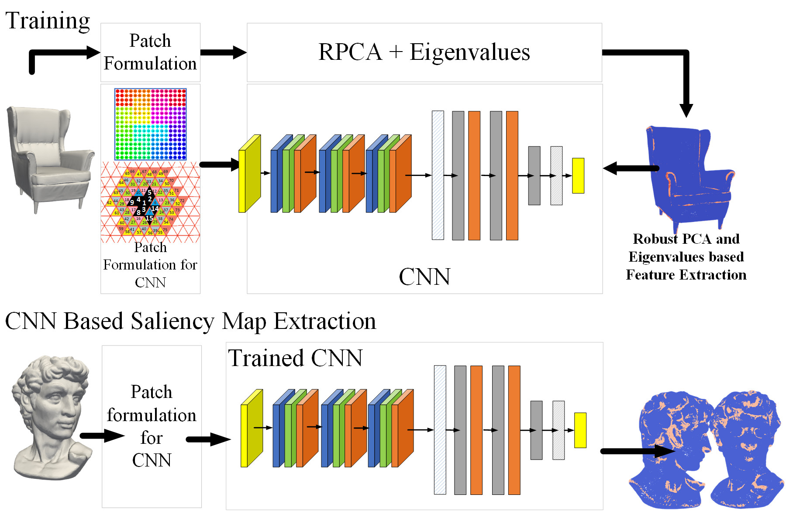

# Mesh Saliency Extraction

This is an implementation for the paper entitled "MESH SALIENCY DETECTION USING CONVOLUTIONAL NEURAL NETWORKS" presented in ICME 2020

## Description 
Mesh saliency has been widely considered as the measure of visual importance of certain parts of 3D geometries, distinguishable from their surroundings, with respect to human visual perception. This work is based on the use of convolutional neural networks to extract saliency maps for large and dense 3D scanned models. The network is trained with saliency maps extracted by fusing local and global spectral characteristics. Extensive evaluation studies carried out using various 3D models, include visual perception evaluation in simplification and compression use cases. As a result, they verify the superiority of our approach as compared to other state-of-the-art approaches. Furthermore, these studies indicate that CNN-based saliency extraction method is much faster in large and dense geometries, allowing the application of saliency aware compression and simplification schemes in low-latency and energy-efficient systems.

## Video presentation

## Requirements

1. Tensorflow
2. Numpy
3. Pickle
4. Matplotlib
5. SKLearn

## Running the code

### Generate groundtruth data

    python saliencyGenerateRPCAGroundTruth.py
    
    

Citation info:
    
    @article{arvanitis2020robust,
    title = {Robust and Fast 3D Saliency Mapping for Industrial Modeling Applications},
    author = {Gerasimos Arvanitis; Aris S Lalos; Konstantinos Moustakas},
    year = {2020},
    date = {2020-06-01},
    journal = {IEEE Transactions on Industrial Informatics},
    keywords = {},
    pubstate = {published},
    tppubtype = {article}
    } 
    
       
       

###Train with groundtruth data

     python saliencyTrain_On_The_Fly.py
     
### Predict 

    python saliencyPredict_On_The_Fly.py
     
# Notes

To select model search for the line in either groundtruth generation of prediction modes

    fullModelPath="./scanned/head.obj"

# Citation info

Citation information will be updated upon completion of the ICME conference

### Citation 

    S. Nousias, G. Arvanitis, A. Lalos, and K. Moustakas, “Mesh saliency detection using convolutional neural networks,” in International Conference on Multimedia and Expo, 2020, no. 1, pp. 1–6.

### Bibtex 

    @inproceedings{Nousias2020,
        address = {London},
        author = {Nousias, Stavros and Arvanitis, Gerasimos and Lalos, Aris and Moustakas, Kostantinos},
        booktitle = {International Conference on Multimedia and Expo},
        number = {1},
        pages = {1--6},
        title = {{Mesh saliency detection using convolutional neural networks}},
        year = {2020}
    }
